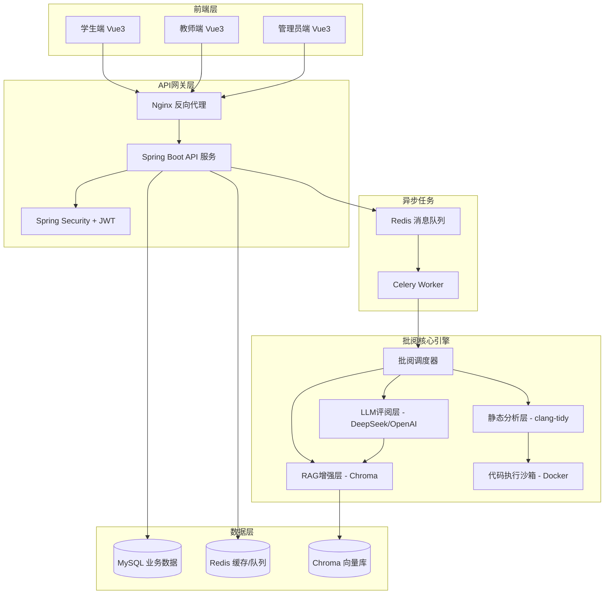
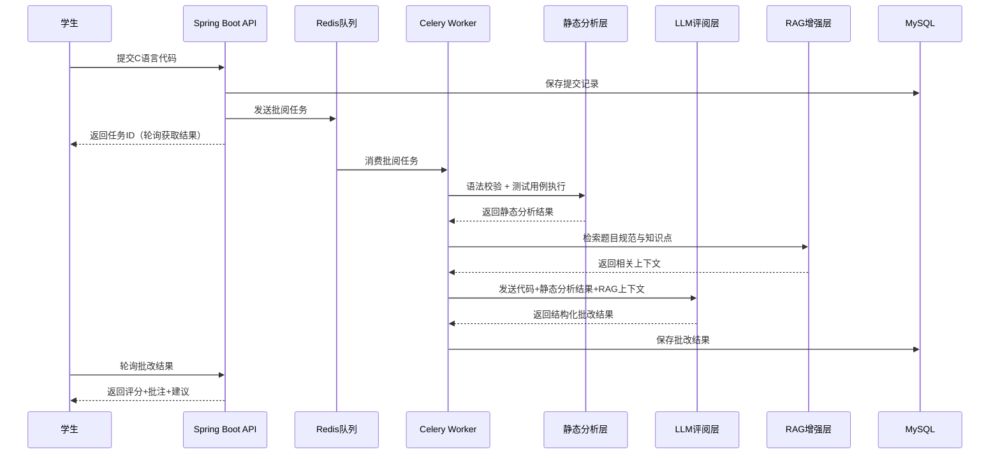

## 产品概述

基于大语言模型的C语言课后作业自动批阅系统，面向"C语言程序设计"课程，解决传统批改中反馈滞后、反馈粗糙、教师负担沉重三大痛点。系统采用"静态分析 + LLM评阅 + RAG增强"三层联动架构，实现对C语言程序代码的自动分析、评分与反馈生成。

## 核心功能

### 一、自动批阅模块（核心差异化能力）

- 学生提交C语言代码后，经静态分析（语法校验+测试用例执行）、LLM评阅（逻辑理解+反馈生成）、RAG增强（课程知识检索注入）三层联动处理，分钟级返回结构化批改结果（评分+逐行批注+改进建议）
- 支持多次提交取最优成绩、迟交自动扣分、超时终止批阅
- 教师可对AI评分进行人工复核与修正，修正结果反哺黄金标准测试集

### 二、课程与班级管理（基础支撑）

- **课程管理**：创建/编辑课程（名称、学期、描述、封面），设置授课教师，课程状态（进行中/已结课/归档），课程下绑定班级和作业
- **班级管理**：创建/编辑班级，批量导入学生（Excel模板），学生选课码邀请加入，教师分配与管理，班级成员列表与信息维护
- **学期管理**：定义教学学期，关联课程周期

### 三、作业与题目管理（核心业务）

- **作业管理**：
- 发布作业（标题、详细描述、起止时间、满分分值、所属课程/班级）
- 作业状态流转：草稿 → 已发布 → 进行中 → 截止中 → 已截止 → 已归档
- 作业可见范围控制（指定班级/公开）
- 批量发布、复制作业（适配多班级复用）
- 作业排序与分类标签（如"实验""练习""考试"）
- **题库管理**：
- 题目CRUD（标题、难度等级★~★★★★★、知识点标签、输入输出说明、时间/内存限制）
- 题目类型支持：编程题（主）、选择题、填空题
- 题目从题库选择并组装为一次作业（一个作业可含多道题）
- 题目版本管理与复用
- **测试用例管理**：
- 为每道编程题配置测试用例（输入+期望输出）
- 公开测试用例（学生可见）vs 隐藏测试用例（仅评分使用）
- 测试用例权重设置（不同用例占比不同）
- 测试用例的增删改查与批量导入

### 四、提交与批阅流程（核心业务流）

- **学生提交**：
- Monaco在线代码编辑器编写C语言代码
- 每道题独立提交，支持同一题多次提交
- 提交时自动保存快照，保留完整提交历史
- 截止时间倒计时提醒，逾期提交标记并扣分
- 实时展示批阅进度条（排队→编译→静态分析→LLM评阅→完成）
- **批改结果查看**：
- 三维度评分（正确性/规范性/效率）+ 总分 + 雷达图可视化
- 逐行代码批注视图（错误行高亮 + 行内气泡批注）
- 编译警告/错误详情、测试用例通过情况
- AI生成的结构化改进建议（按优先级排序）
- 历次提交对比（查看进步趋势）
- **教师审核**：
- 查看班级整体批改结果概览
- 逐个审阅AI评分，支持人工修正分数与评语
- 一键批量审核通过 / 逐个打回重批
- 异常评分标记与告警（偏差超阈值）

### 五、学情分析模块（数据洞察）

- **班级维度**：作业完成率、平均分/最高分/最低分/中位数、提交时间分布、成绩分布直方图
- **个人维度**：学生个人成绩趋势折线图、知识点掌握度热力图、错误类型分布饼图、排名变化追踪
- **题目维度**：每道题的正确率、平均耗时、常见错误Top10柱状图、区分度分析
- **导出功能**：成绩报表导出（Excel/PDF格式）、自定义时间段与筛选条件

### 六、通知消息系统

- **作业通知**：新作业发布通知、作业即将截止提醒（24h前/1h前）、截止时间变更通知
- **批改通知**：批改完成推送、教师复核意见通知、成绩公布通知
- **系统通知**：账号异常登录、系统维护公告
- **公告栏**：教师发布课程级公告，置顶与普通公告区分
- 通知渠道：站内消息中心（未读数角标） + 可扩展邮件

### 七、用户与权限管理（系统基础）

- **用户体系**：学生/教师/管理员三角色，注册/登录/登出，JWT Token鉴权
- **个人信息**：头像上传、昵称修改、密码修改、绑定信息维护
- **角色权限矩阵**：

| 功能 | 学生 | 教师 | 管理员 |
| --- | --- | --- | --- |
| 提交代码 | ✓ | - | - |
| 查看自己的批改结果 | ✓ | - | - |
| 查看/导出班级成绩 | - | ✓(本班) | ✓ |
| 发布/管理作业 | - | ✓ | ✓ |
| 审核/修正AI评分 | - | ✓ | ✓ |
| 题库管理 | - | ✓ | ✓ |
| 班级与学生管理 | - | ✓ | ✓ |
| 用户管理 | - | - | ✓ |
| 系统配置 | - | - | ✓ |


### 八、异步任务处理与安全

- 基于Celery/Redis的异步批阅队列，支持高并发提交，前端轮询获取结果
- 代码执行沙箱：Docker容器隔离，限制CPU/内存/网络/文件系统
- API接口鉴权：JWT Token + 角色权限控制
- LLM Prompt注入防护

### 九、文件附件管理

- 题目附件上传（参考图片、数据文件等）
- 课程参考资料共享区
- 作业要求文档附件

## 技术栈

### 后端

- **框架**：Spring Boot 3.x（Java 17+）
- **数据库**：MySQL 8.0（业务数据）+ Redis（缓存+消息队列+会话）
- **异步任务**：Celery + Redis（批阅任务异步处理）
- **ORM**：MyBatis-Plus / Spring Data JPA
- **安全认证**：Spring Security + JWT
- **API文档**：Swagger/Knife4j

### 批阅核心引擎

- **静态分析层**：clang-tidy（语法校验）+ 自定义AST解析 + Docker沙箱编译执行测试用例
- **LLM层**：DeepSeek API（主）/ OpenAI API（备），结构化Prompt模板 + Few-shot示例
- **RAG层**：Chroma向量数据库 + Sentence-Transformers嵌入模型，存储C语言课程知识库与题目规范
- **任务调度**：Celery + Redis Broker，批阅任务后台排队处理

### 前端

- **框架**：Vue 3 + TypeScript
- **UI组件库**：Element Plus
- **代码编辑器**：Monaco Editor（集成代码高亮与编辑）
- **状态管理**：Pinia
- **HTTP客户端**：Axios
- **图表库**：ECharts（学情分析可视化）

### 部署与运维

- **容器化**：Docker + Docker Compose
- **反向代理**：Nginx

## 实现方案

### 系统架构

采用前后端分离 + 微服务化思维的模块分层架构，核心批阅引擎独立封装为服务，通过消息队列与Web应用解耦。



### 批阅核心流程



### 批阅三层联动详细设计

1. **静态分析层**：先对提交代码执行clang-tidy语法检查和风格检测，再在Docker沙箱中编译并运行测试用例，收集编译错误、运行结果、内存泄漏等信息，作为LLM输入的前置确定性信息
2. **RAG增强层**：根据题目ID检索Chroma向量库中该题目的规范要求、评分标准、常见错误模式和相关C语言知识点，注入LLM上下文
3. **LLM评阅层**：将学生代码、静态分析结果、RAG检索上下文、题目要求、Few-shot示例组合成结构化Prompt，约束LLM按正确性/规范性/效率三维度评分，输出JSON格式批改结果

### 一致性保障机制

- 建立"黄金标准"测试集（人工标注的真实学生作业+评分）
- 每次LLM评分与黄金标准对比，偏差超阈值时自动降级为规则打分并告警

## 实现要点

### 性能考量

- 批阅是IO密集型（LLM API调用 + 代码编译执行），必须异步处理
- LLM API调用延迟约5-15秒/次，通过Celery并发Worker池（建议4-8个Worker）提升吞吐
- Redis缓存题目信息和RAG检索结果，避免重复计算
- 前端采用长轮询（2秒间隔）获取批改状态，避免WebSocket复杂度

### 安全考量

- 代码执行沙箱：Docker容器隔离，限制CPU时间（5秒）、内存（256MB）、网络访问、文件系统只读
- API接口鉴权：JWT Token + 角色权限控制（学生/教师/管理员）
- LLM Prompt注入防护：对用户提交代码做基础过滤，防止Prompt注入攻击

### 日志与监控

- 批阅全链路日志记录（提交时间、各层处理耗时、LLM返回结果）
- LLM评分偏差监控告警

## 目录结构

```
c-autograding-system/
├── frontend/                          # 前端项目（Vue3 + TypeScript）
│   ├── public/
│   ├── src/
│   │   ├── api/                       # API请求封装
│   │   │   ├── auth.ts                # 认证相关API
│   │   │   ├── assignment.ts          # 作业相关API
│   │   │   ├── problem.ts             # 题目/题库相关API
│   │   │   ├── submission.ts          # 提交记录相关API
│   │   │   ├── grading.ts             # 批阅结果相关API
│   │   │   ├── analytics.ts           # 学情分析API
│   │   │   ├── course.ts              # 课程/班级API
│   │   │   ├── notification.ts        # 通知消息API
│   │   │   └── user.ts                # 用户/个人中心API
│   │   ├── components/                # 通用组件
│   │   │   ├── CodeEditor/            # Monaco代码编辑器封装
│   │   │   ├── GradingResult/         # 批改结果展示组件
│   │   │   ├── Statistics/            # 统计图表组件（ECharts封装）
│   │   │   ├── NotificationBell/      # 通知铃铛组件
│   │   │   ├── FileUpload/            # 文件上传组件
│   │   │   ├── UserAvatar/            # 用户头像组件
│   │   │   └── Common/                # 通用UI（分页、搜索、空状态等）
│   │   ├── views/                     # 页面视图
│   │   │   ├── auth/                  # 认证页面
│   │   │   │   ├── Login.vue          # 登录页
│   │   │   │   └── Register.vue       # 注册页
│   │   │   ├── student/               # 学生端页面
│   │   │   │   ├── Dashboard.vue      # 学生仪表盘（概览+待办）
│   │   │   │   ├── CourseList.vue     # 我的课程列表
│   │   │   │   ├── AssignmentList.vue # 作业列表（某课程下）
│   │   │   │   ├── AssignmentDetail.vue# 作业详情+题目列表
│   │   │   │   ├── CodeSubmit.vue     # 代码编写与提交页
│   │   │   │   ├── GradingResult.vue  # 批改结果查看（单次提交详情）
│   │   │   │   ├── SubmissionHistory.vue # 提交历史（历次对比）
│   │   │   │   └── Profile.vue        # 个人信息设置
│   │   │   ├── teacher/               # 教师端页面
│   │   │   │   ├── Dashboard.vue      # 教师仪表盘（数据概览）
│   │   │   │   ├── CourseManage.vue   # 课程管理（CRUD）
│   │   │   │   ├── ClassManage.vue    # 班级管理+学生导入
│   │   │   │   ├── AssignmentPublish.vue # 发布/管理作业
│   │   │   │   ├── ProblemBank.vue    # 题库管理
│   │   │   │   ├── ProblemEditor.vue  # 题目编辑器（含测试用例配置）
│   │   │   │   ├── TestCaseManage.vue # 测试用例管理
│   │   │   │   ├── GradingReview.vue  # 批改审核（AI结果复核）
│   │   │   │   ├── Analytics.vue      # 学情分析仪表盘
│   │   │   │   ├── ScoreExport.vue    # 成绩管理与导出
│   │   │   │   ├── Announcement.vue   # 公告发布与管理
│   │   │   │   └── Profile.vue        # 个人信息设置
│   │   │   ├── admin/                 # 管理员页面
│   │   │   │   ├── Dashboard.vue      # 系统总览仪表盘
│   │   │   │   ├── UserManage.vue     # 用户管理
│   │   │   │   ├── SystemConfig.vue   # 系统配置（LLM参数、沙箱策略等）
│   │   │   │   └── OperationLog.vue   # 操作日志查看
│   │   │   └── common/                # 公共页面
│   │   │       ├── NotFound.vue       # 404页面
│   │   │       └── AnnouncementDetail.vue # 公告详情
│   │   ├── stores/                    # Pinia状态管理
│   │   │   ├── auth.ts               # 认证状态
│   │   │   ├── user.ts               # 用户信息
│   │   │   ├── assignment.ts         # 作业状态
│   │   │   ├── grading.ts            # 批阅状态
│   │   │   └── notification.ts       # 通知状态
│   │   ├── router/                    # 路由配置（含角色守卫）
│   │   ├── utils/                     # 工具函数
│   │   ├── composables/               # 组合式函数
│   │   │   ├── usePolling.ts          # 轮询Hook（批改进度）
│   │   │   ├── usePermission.ts       # 权限检查Hook
│   │   │   └── useCountdown.ts        # 倒计时Hook（截止时间）
│   │   ├── types/                     # TypeScript类型定义
│   │   ├── styles/                    # 全局样式
│   │   ├── App.vue
│   │   └── main.ts
│   ├── package.json
│   ├── vite.config.ts
│   └── tsconfig.json
│
├── backend/                           # 后端项目（Spring Boot）
│   ├── src/main/java/com/autograding/
│   │   ├── config/                    # 配置类
│   │   │   ├── SecurityConfig.java    # Spring Security + JWT配置
│   │   │   ├── RedisConfig.java       # Redis配置
│   │   │   ├── SwaggerConfig.java     # API文档配置
│   │   │   ├── CorsConfig.java        # 跨域配置
│   │   │   ├── MultipartConfig.java   # 文件上传配置
│   │   │   └── AsyncConfig.java       # 异步任务配置
│   │   ├── controller/                # 控制器层
│   │   │   ├── AuthController.java    # 认证接口（登录/注册/刷新Token）
│   │   │   ├── UserController.java    # 用户信息接口
│   │   │   ├── CourseController.java  # 课程管理接口
│   │   │   ├── ClassController.java   # 班级管理接口
│   │   │   ├── AssignmentController.java # 作业管理接口
│   │   │   ├── ProblemController.java # 题库管理接口
│   │   │   ├── TestCaseController.java # 测试用例接口
│   │   │   ├── SubmissionController.java # 提交接口
│   │   │   ├── GradingController.java # 批阅结果查询接口
│   │   │   ├── GradingReviewController.java # 教师审核接口
│   │   │   ├── AnalyticsController.java # 学情分析接口
│   │   │   ├── NotificationController.java # 通知消息接口
│   │   │   ├── FileController.java    # 文件上传下载接口
│   │   │   └── AdminController.java   # 管理员接口（用户/系统配置/日志）
│   │   ├── service/                   # 业务逻辑层
│   │   │   ├── AuthService.java
│   │   │   ├── UserService.java
│   │   │   ├── CourseService.java
│   │   │   ├── ClassService.java
│   │   │   ├── AssignmentService.java # 含作业状态流转逻辑
│   │   │   ├── ProblemService.java
│   │   │   ├── TestCaseService.java
│   │   │   ├── SubmissionService.java # 提交校验+快照保存
│   │   │   ├── GradingService.java    # 批阅调度服务（投递到Redis队列）
│   │   │   ├── GradingReviewService.java # 审核修正服务
│   │   │   ├── AnalyticsService.java  # 统计聚合服务
│   │   │   ├── NotificationService.java # 通知推送服务（含定时提醒）
│   │   │   ├── FileService.java
│   │   │   └── AdminService.java
│   │   ├── mapper/                    # MyBatis-Plus数据访问层
│   │   │   ├── UserMapper.java
│   │   │   ├── CourseMapper.java
│   │   │   ├── ClassMapper.java
│   │   │   ├── ClassStudentMapper.java # 班级-学生关联
│   │   │   ├── AssignmentMapper.java
│   │   │   ├── AssignmentProblemMapper.java # 作业-题目关联
│   │   │   ├── ProblemMapper.java
│   │   │   ├── TestCaseMapper.java
│   │   │   ├── SubmissionMapper.java
│   │   │   ├── GradingResultMapper.java
│   │   │   ├── NotificationMapper.java
│   │   │   └── OperationLogMapper.java
│   │   ├── entity/                    # 数据库实体类
│   │   │   ├── User.java
│   │   │   ├── Course.java
│   │   │   ├── Class.java
│   │   │   ├── Assignment.java
│   │   │   ├── Problem.java
│   │   │   ├── TestCase.java
│   │   │   ├── Submission.java
│   │   │   ├── GradingResult.java
│   │   │   ├── Notification.java
│   │   │   ├── Announcement.java
│   │   │   └── OperationLog.java
│   │   ├── dto/                       # 数据传输对象
│   │   │   ├── auth/                  # 认证相关DTO
│   │   │   ├── assignment/            # 作业相关DTO
│   │   │   ├── grading/               # 批阅相关DTO
│   │   │   ├── analytics/             # 分析统计DTO
│   │   │   └── user/                  # 用户相关DTO
│   │   ├── common/                    # 通用模块
│   │   │   ├── Result.java            # 统一响应封装
│   │   │   ├── PageResult.java        # 分页响应封装
│   │   │   ├── BusinessException.java
│   │   │   ├── Constants.java
│   │   │   ├── annotation/            # 自定义注解（@RateLimit等）
│   │   │   └── util/                  # 工具类（JWT/文件/Excel导入导出）
│   │   ├── scheduler/                 # 定时任务
│   │   │   └── NotificationScheduler.java # 截止提醒/逾期处理定时任务
│   │   ├── security/                  # 安全模块
│   │   │   ├── JwtTokenProvider.java
│   │   │   ├── UserDetailsServiceImpl.java
│   │   │   └── PermissionInterceptor.java
│   │   └── AutogradingApplication.java # 启动类
│   ├── src/main/resources/
│   │   ├── application.yml            # 主配置
│   │   ├── application-dev.yml        # 开发环境配置
│   │   ├── application-prod.yml       # 生产环境配置
│   │   └── mapper/                    # MyBatis XML映射文件（如需要）
│   └── pom.xml
│
├── grading-engine/                    # 批阅核心引擎（Python，独立微服务）
│   ├── celery_app.py                  # Celery应用配置与Worker入口
│   ├── tasks/
│   │   ├── grading_task.py            # 批阅主任务（编排三层联动）
│   │   ├── consistency_check_task.py  # 一致性检测任务（黄金标准对比）
│   │   └── notification_task.py       # 批改完成通知任务
│   ├── core/
│   │   ├── dispatcher.py              # 批阅调度器（编排三层分析流程）
│   │   ├── static_analyzer.py         # 静态分析层（clang-tidy调用）
│   │   ├── llm_service.py             # LLM评阅层（API调用+Prompt构建+重试）
│   │   ├── rag_service.py             # RAG增强层（向量检索+上下文注入）
│   │   ├── sandbox.py                 # 代码执行沙箱（Docker隔离编译运行）
│   │   └── scorer.py                 # 规则打分降级方案（LLM偏差超阈值时启用）
│   ├── prompts/
│   │   ├── system_prompt_template.py  # 系统Prompt模板（含评分维度定义）
│   │   ├── few_shot_examples.py       # Few-shot示例数据（按题型分类）
│   │   └── output_schema.py           # 输出格式定义（JSON Schema）
│   ├── rag/
│   │   ├── embedding.py               # 文本嵌入模型（Sentence-Transformers）
│   │   ├── vector_store.py            # Chroma向量库操作
│   │   ├── knowledge_loader.py        # 知识库文档加载与切分
│   │   ├── retriever.py               # 混合检索（向量+关键词）
│   │   └── data/                      # RAG知识库原始数据
│   │       ├── c_knowledge/           # C语言知识点文档
│   │       ├── error_patterns/        # 常见错误模式库
│   │       ├── grading_rubrics/       # 各题型评分标准
│   │       └── problem_contexts/      # 题目规范与上下文
│   ├── utils/                         # 工具函数
│   │   ├── code_parser.py             # C代码解析辅助
│   │   ├── result_formatter.py        # 批改结果标准化输出
│   │   └── retry.py                   # LLM API重试机制
│   ├── requirements.txt
│   ├── Dockerfile
│   └── config.yaml                    # 引擎独立配置（模型选择/超时/并发数）
│
├── docker/                            # Docker编排
│   ├── docker-compose.yml             # 全栈容器编排（MySQL+Redis+Chroma+Nginx+后端+引擎）
│   ├── docker-compose.dev.yml         # 开发环境快速启动
│   ├── mysql/
│   │   ├── init.sql                   # 数据库初始化脚本（建表建索引）
│   │   └── seed.sql                   # 种子数据（管理员账号/测试数据）
│   ├── redis/
│   │   └── redis.conf                 # Redis持久化配置
│   ├── sandbox/
│   │   └── Dockerfile.sandbox         # 代码执行沙箱镜像
│   └── nginx/
│       ├── nginx.conf                 # Nginx反向代理+静态资源+缓存配置
│       └── conf.d/
│           └── default.conf
│
├── docs/                              # 项目文档
│   ├── api/                           # API接口文档
│   ├── design/                        # 系统设计文档（ER图/时序图等）
│   ├── database/                      # 数据库设计文档
│   ├── deployment/                    # 部署文档
│   └── thesis/                        # 毕业论文相关素材
│
├── scripts/                           # 辅助脚本（已有147个JS/138个TS文件）
│   └── ...                            # 现有辅助工具脚本
│
└── README.md                          # 项目说明文档
```

## 设计风格

采用现代教育科技风格，以简约专业为基调，融合Glassmorphism设计语言。界面分为三个角色视角：学生端、教师端、管理员端，侧边栏导航 + 内容区布局。

## 数据库核心表设计

### ER关系概览

```
用户(User) ──1:N──> 课程(Course)  [教师创建课程]
用户(User) ──M:N──> 班级(Class)  [通过ClassStudent关联]
班级(Class) ──1:N──> 作业(Assignment) [作业发布到班级]
作业(Assignment) ──M:N──> 题目(Problem) [通过AssignmentProblem关联]
题目(Problem) ──1:N──> 测试用例(TestCase)
用户(Student) ──1:N──> 提交记录(Submission)
提交记录(Submission) ──1:1──> 批改结果(GradingResult)
通知(Notification) ──N:1──> 用户(User)
```

### 核心数据表

| 表名 | 说明 | 核心字段 |
|------|------|----------|
| `user` | 用户表 | id, username, password_hash, nickname, avatar, role(STUDENT/TEACHER/ADMIN), status, created_at |
| `course` | 课程表 | id, name, description, teacher_id(FK→user), semester, cover_url, status(ACTIVE/ARCHIVED), created_at |
| `class` | 班级表 | id, name, course_id(FK→course), invite_code(唯一选课码), created_at |
| `class_student` | 班级-学生关联表 | id, class_id(FK), student_id(FK→user), joined_at |
| `assignment` | 作业表 | id, title, description, course_id(FK), start_time, end_time, max_score, type(EXAM/LAB/PRACTICE), status(DRAFT/PUBLISHED/EXPIRED/ARCHIVED), late_penalty_score, created_by(FK→user) |
| `assignment_problem` | 作业-题目关联表（多对多） | id, assignment_id(FK), problem_id(FK), sort_order(题目顺序) |
| `problem` | 题库表（题目独立于作业） | id, title, description, difficulty(1-5), input_desc, output_desc, time_limit_ms, memory_limit_kb, knowledge_tags(JSON), creator_id(FK→user), is_public |
| `test_case` | 测试用例表 | id, problem_id(FK), input_data, expected_output, is_hidden(公开/隐藏), weight(权重), sort_order |
| `submission` | 提交记录表 | id, assignment_id(FK), problem_id(FK), student_id(FK→user), code_content, language("c"), submit_count(第几次提交), is_late, submitted_at |
| `grading_result` | 批改结果表 | id, submission_id(FK:1:1), total_score, correctness_score, style_score, efficiency_score, feedback_json(JSON:批注/建议列表), test_case_result(JSON), static_analysis_result(JSON), llm_raw_response, grading_status(PENDING/PROCESSING/DONE/FAILED), reviewed_by(FK→teacher), human_adjusted_score, reviewed_at, graded_at |
| `notification` | 通知消息表 | id, user_id(FK), title, content, type(ASSIGNMENT/GRADING/SYSTEM/ANNOUNCEMENT), is_read, related_id(关联业务ID), created_at |
| `announcement` | 公告表 | id, course_id(FK), publisher_id(FK→user), title, content, is_pinned, created_at |
| `operation_log` | 操作日志表 | id, user_id(FK), action, target_type, target_id, detail(JSON), ip_address, created_at |

## 页面规划（按角色分类）

### 公共页面

| 页面 | 说明 |
|------|------|
| 登录页 | 系统Logo + 毛玻璃登录卡片（用户名/密码）+ 深色渐变背景+代码符号动画 |
| 注册页 | 学生/教师注册表单，含选课码输入（学生）/ 教师申请审核流程 |
| 404页面 | 友好的错误提示 |

### 学生端页面（~8个核心页面）

| 页面 | 核心功能 |
|------|----------|
| **学生仪表盘** | 待办作业列表（按截止时间排序）、最近提交记录、课程快捷入口、通知未读数角标 |
| **我的课程** | 已加入课程卡片列表（教师头像、进度条、最近作业状态），选课码加入新课程 |
| **作业列表** | 某课程下所有作业：标题、状态标签(进行中/已截止)、截止倒计时、得分/满分、提交次数 |
| **作业详情** | 作业描述面板 + 题目列表（每题显示是否已提交/最高分）→ 点击进入代码编写 |
| **代码编写与提交** | 左侧题目要求+IO说明，右侧Monaco编辑器(C语言高亮)，底部提交按钮+批改进度条 |
| **批改结果** | 总分大数字 + 三维度雷达图 + 逐行批注气泡视图 + 测试用例通过列表 + 改进建议卡片 |
| **提交历史** | 历次提交时间线，可切换查看每次的代码和评分，进步/退步趋势箭头 |
| **个人设置** | 头像上传、昵称修改、密码修改 |

### 教师端页面（~12个核心页面）

| 页面 | 核心功能 |
|------|----------|
| **教师仪表盘** | 统计卡片区(总学生数/总作业数/待审核数/平均分) + 近期活动动态 + 快捷操作入口 |
| **课程管理** | 课程CRUD列表，设置学期、关联班级、课程状态切换 |
| **班级管理** | 班级列表 → 成员管理（批量Excel导入/手动添加/移除）→ 选课码展示 |
| **发布作业** | 步骤式向导：基本信息→选择题目(从题库)→设置时间范围→指定班级→发布 |
| **题库管理** | 题目卡片列表（名称/难度星标/知识点标签/使用次数），新建/编辑/删除/复制题目 |
| **题目编辑器** | 完整表单：标题+描述+难度+知识点多选+输入输出说明+时间内存限制+测试用例配置区 |
| **测试用例管理** | 为某道题管理测试用例：输入框+期望输出框，标记公开/隐藏，设置权重 |
| **批改审核** | 班级作业批改结果总览表格 → 逐个查看AI评分详情 → 支持修正分数/评语 → 批量通过/打回 |
| **学情分析仪表盘** | 多维度图表区：成绩分布直方图、知识点热力图、错误Top10柱状图、趋势折线图 + 学生排名表 |
| **成绩导出** | 选择课程/作业/时间段/班级 → 预览报表 → 导出Excel/PDF |
| **公告管理** | 发布/编辑/置顶/删除公告，支持Markdown富文本 |
| **个人设置** | 头像/昵称/密码修改 |

### 管理员端页面（~4个页面）

| 页面 | 核心功能 |
|------|----------|
| **系统概览** | 全局统计（用户总数/课程数/今日提交数/系统负载） |
| **用户管理** | 用户列表表格（角色筛选/搜索/禁用启用/重置密码） |
| **系统配置** | LLM API参数（模型选择/Key/超时/重试次数）、沙箱策略（CPU/内存限制）、评分阈值配置 |
| **操作日志** | 关键操作的审计日志（时间/操作人/操作类型/详情）

## 通用组件

- 侧边栏导航：角色自适应菜单项，当前页高亮
- 批改状态轮询条：提交后实时显示进度（静态分析->LLM评阅->RAG增强->完成）

## SubAgent

- **code-explorer**
- 用途：在创建项目目录结构和文件时，搜索现有scripts目录中可复用的代码模式
- 预期结果：确认现有辅助脚本与项目代码的关系，避免重复工作

## Skill

- **docx**
- 用途：若需要将架构设计文档输出为Word格式
- 预期结果：生成符合学校格式要求的架构设计文档